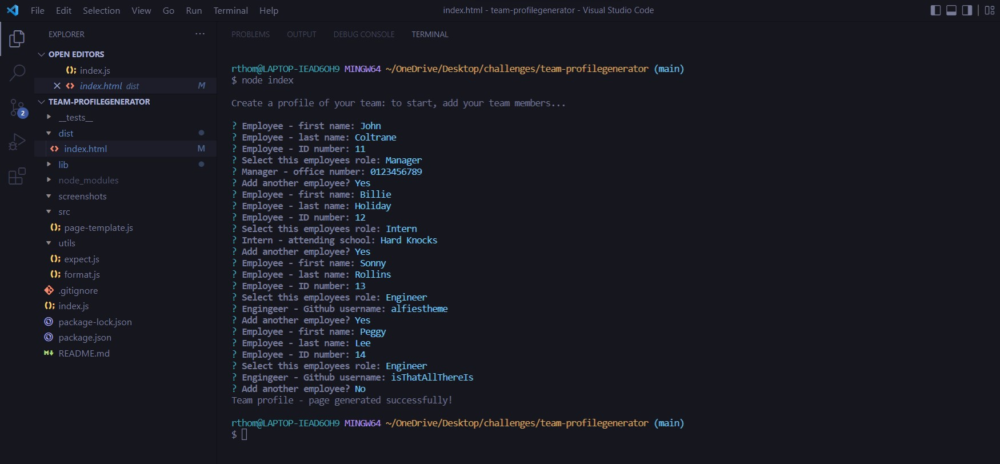
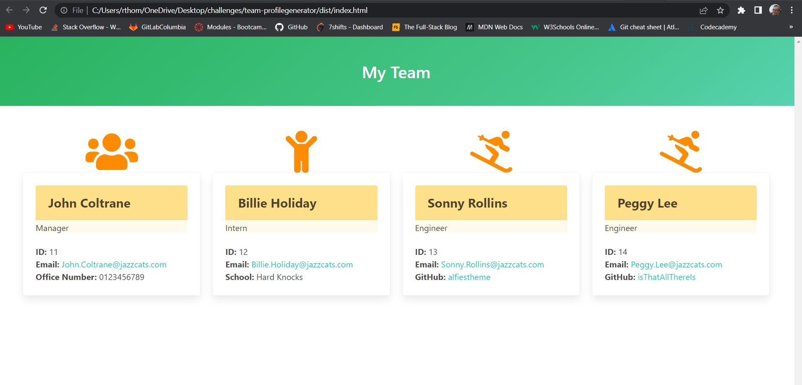
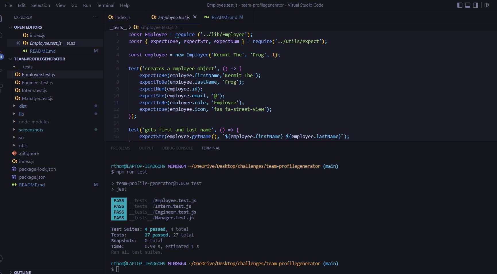

# Team Profile Generator

### Video Demo

## Description
A simple Node.js application to generate a simple profile of a teams manager, interns and engineers.

## Contents
* [Video Demo](#Video-Demo)
* [Usage](#Usage)
* [Screenshots](#Screenshots)
* [Tests](#Tests)
* [Questions](#Questions)

## Installation
To use this application, please install: 

npm install inquirer

## Usage
Clone the repo and use the command line terminal to install 'npm inquirer'. Then run `node index` from the root of the project.  
Follow the prompts to add team members. When finished an HTML will be generated in the `./dist` folder. 
    
### Screenshots

An example of the generated team roster page.

An example of the generated team roster page.

## Tests
To test this application, please install: 

npm install jest

Then run `npm run test` from the command line.